# GDFS Implementation Research Plan
## Global Decentralized Financial System - Comprehensive Research Requirements

---

## Executive Summary

This document outlines the comprehensive research requirements for implementing the Global Decentralized Financial System (GDFS), a multi-bank coordination platform that enables users to distribute funds across multiple traditional banks while maintaining unified control through blockchain-based smart contracts.

## Research Architecture Overview

```mermaid
graph TD
    A[GDFS Technical Implementation Research] --> B[Legal & Regulatory Framework]
    A --> C[Blockchain & Smart Contract Architecture]
    A --> D[Currency Basket & Exchange Rate System]
    A --> E[Multi-Bank Payment Optimization]
    A --> F[Risk Assessment & Technical Mitigation]
    A --> G[Implementation Strategy]
    
    B --> B1[Banking Regulations & Licensing]
    B --> B2[Cross-Border Compliance]
    B --> B3[Smart Contract Legal Framework]
    
    C --> C1[Blockchain Platform Selection]
    C --> C2[Smart Contract Development]
    C --> C3[Bank Integration Protocol]
    C --> C4[Consensus Mechanisms]
    
    D --> D1[Multi-Currency Portfolio Management]
    D --> D2[Real-time Exchange Rate Integration]
    D --> D3[Currency Risk Hedging Algorithms]
    D --> D4[Rebalancing Mechanisms]
    
    E --> E1[Payment Routing Optimization]
    E --> E2[Cross-Currency Transaction Logic]
    E --> E3[Multi-Bank Settlement]
    E --> E4[Cost Minimization Algorithms]
    
    F --> F1[Smart Contract Security]
    F --> F2[Financial Risk Models]
    F --> F3[Operational Risks]
    
    G --> G1[Pilot Development]
    G --> G2[Phased Technical Rollout]
    G --> G3[Infrastructure Planning]
```

---

## Phase 1: Legal & Regulatory Framework Research

### 1.1 Banking Regulations & Licensing Requirements

**Research Objectives:**
- Understand regulatory requirements for operating a multi-bank coordination system
- Identify licensing pathways for blockchain-based financial services
- Analyze compliance requirements for automated currency operations

**Specific Research Tasks:**

#### 1.1.1 Payment Institution Licensing
- **Germany (BaFin):**
  - Research Payment Institution License requirements under PSD2
  - Analyze Electronic Money Institution (EMI) license applicability
  - Study supervisory requirements for cross-border operations
  - Investigate licensing timeline and capital requirements
  
- **United States (Multiple Regulators):**
  - Research Money Services Business (MSB) registration requirements
  - Analyze state-by-state money transmitter licensing
  - Study OCC fintech charter possibilities
  - Investigate FDIC partnership requirements
  
- **United Kingdom (FCA):**
  - Research Authorized Payment Institution (API) licensing
  - Analyze Electronic Money Institution registration
  - Study Open Banking compliance requirements
  - Investigate sandbox participation opportunities
  
- **Lithuania (Bank of Lithuania):**
  - Research Payment Institution License under PSD2
  - Analyze EMI license for EU passporting
  - Study supervisory cooperation agreements
  - Investigate FinTech licensing fast-track procedures

#### 1.1.2 Blockchain-Specific Financial Regulations
- Research regulatory guidance on smart contracts in financial services
- Analyze DeFi regulations and their applicability to hybrid systems
- Study digital asset regulations impact on traditional banking integration
- Investigate stablecoin regulations and their effect on currency baskets
- Research MiCA (Markets in Crypto Assets) regulation compliance

#### 1.1.3 Cross-Border Financial Services Regulation
- Analyze correspondent banking regulations for blockchain systems
- Research cross-border payment notification requirements
- Study international wire transfer regulations
- Investigate foreign exchange dealer licensing requirements
- Research anti-structuring regulations for automated systems

### 1.2 Cross-Border Compliance Framework

**Research Objectives:**
- Understand multi-jurisdiction compliance requirements
- Develop automated compliance monitoring strategies
- Create regulatory reporting frameworks

**Specific Research Tasks:**

#### 1.2.1 International Sanctions Compliance
- **OFAC (United States):**
  - Research sanctions list screening requirements
  - Analyze blocking requirements for smart contracts
  - Study reporting obligations for automated systems
  - Investigate geographic targeting mechanisms
  
- **EU Sanctions Framework:**
  - Research EU Consolidated List integration requirements
  - Analyze member state specific sanctions
  - Study financial restriction implementation
  - Investigate cross-border enforcement coordination
  
- **UN Sanctions:**
  - Research UN Security Council sanctions lists
  - Analyze implementation requirements across jurisdictions
  - Study conflict resolution for conflicting sanctions
  - Investigate humanitarian exemption procedures

#### 1.2.2 AML/KYC Compliance for Multi-Bank Systems
- Research customer identification requirements across jurisdictions
- Analyze beneficial ownership reporting for complex structures
- Study enhanced due diligence for high-risk customers
- Investigate ongoing monitoring requirements for automated systems
- Research suspicious activity reporting for algorithmic detection

#### 1.2.3 Cross-Border Data Transfer Compliance
- **GDPR Article 44-49 Research:**
  - Analyze adequacy decisions for target jurisdictions
  - Research appropriate safeguards for data transfers
  - Study binding corporate rules for multinational operations
  - Investigate derogations for financial services
  
- **Other Privacy Frameworks:**
  - Research CCPA compliance for California customers
  - Analyze PIPEDA requirements for Canadian operations
  - Study UK GDPR post-Brexit implications
  - Investigate data localization requirements

### 1.3 Smart Contract Legal Framework

**Research Objectives:**
- Establish legal validity of smart contracts across jurisdictions
- Develop liability frameworks for automated decisions
- Create dispute resolution mechanisms

**Specific Research Tasks:**

#### 1.3.1 Smart Contract Legal Recognition
- Research smart contract legal status in each target jurisdiction
- Analyze contract formation requirements for automated systems
- Study electronic signature law compliance
- Investigate evidence requirements for smart contract execution
- Research statute of limitations for smart contract disputes

#### 1.3.2 Automated Decision-Making Liability
- Research liability frameworks for algorithmic financial decisions
- Analyze duty of care requirements for automated systems
- Study professional indemnity insurance for smart contracts
- Investigate consumer protection law compliance
- Research fiduciary duty implications for automated advice

#### 1.3.3 Dispute Resolution Mechanisms
- Research arbitration frameworks for smart contract disputes
- Analyze court jurisdiction for cross-border blockchain disputes
- Study alternative dispute resolution for financial services
- Investigate regulatory complaint mechanisms
- Research class action implications for smart contract failures

---

## Phase 2: Blockchain & Smart Contract Architecture

### 2.1 Blockchain Platform Selection & Analysis

**Research Objectives:**
- Select optimal blockchain platform for financial operations
- Analyze scalability and performance requirements
- Evaluate integration capabilities with traditional banking

**Specific Research Tasks:**

#### 2.1.1 Enterprise Blockchain Platform Evaluation
- **Ethereum:**
  - Research Ethereum 2.0 scalability for financial applications
  - Analyze gas cost implications for frequent transactions
  - Study smart contract upgradeability patterns
  - Investigate enterprise features and privacy options
  
- **Hyperledger Fabric:**
  - Research permissioned network configuration
  - Analyze multi-organization channel architecture
  - Study integration with traditional banking systems
  - Investigate performance benchmarks for financial workloads
  
- **R3 Corda:**
  - Research financial services specific features
  - Analyze SWIFT integration capabilities
  - Study regulatory compliance tools
  - Investigate bank consortium deployment models
  
- **Other Platforms:**
  - Research Quorum enterprise features
  - Analyze Polygon scalability solutions
  - Study Avalanche subnet capabilities
  - Investigate custom blockchain development requirements

#### 2.1.2 Consensus Mechanism Analysis
- Research Proof of Authority for financial applications
- Analyze Byzantine Fault Tolerance for banking environments
- Study hybrid consensus mechanisms
- Investigate finality requirements for financial transactions
- Research validator node requirements and governance

#### 2.1.3 Interoperability & Integration Research
- Research blockchain-to-database integration patterns
- Analyze API gateway requirements for blockchain exposure
- Study event-driven architecture for real-time integration
- Investigate message queue integration for bank communications
- Research hybrid cloud deployment architectures

### 2.2 Smart Contract Development Framework

**Research Objectives:**
- Establish secure smart contract development practices
- Create testing and validation frameworks
- Develop upgradeability and governance mechanisms

**Specific Research Tasks:**

#### 2.2.1 Smart Contract Security Research
- **Security Best Practices:**
  - Research reentrancy attack prevention
  - Analyze integer overflow/underflow protection
  - Study access control pattern implementation
  - Investigate front-running protection mechanisms
  - Research gas optimization techniques
  
- **Formal Verification Methods:**
  - Research mathematical proof techniques for financial logic
  - Analyze model checking for smart contract verification
  - Study symbolic execution tools
  - Investigate property-based testing frameworks
  - Research runtime verification techniques

#### 2.2.2 Smart Contract Architecture Patterns
- Research proxy pattern implementation for upgradeability
- Analyze factory pattern for multi-bank deployment
- Study oracle pattern for external data integration
- Investigate state machine patterns for complex workflows
- Research multi-signature patterns for governance

#### 2.2.3 Testing & Quality Assurance Framework
- Research unit testing frameworks for smart contracts
- Analyze integration testing with external services
- Study chaos engineering for blockchain systems
- Investigate performance testing methodologies
- Research security audit processes and tools

### 2.3 Bank Integration Protocol Design

**Research Objectives:**
- Design secure communication protocols between blockchain and banks
- Create event-driven architecture for real-time coordination
- Establish data synchronization mechanisms

**Specific Research Tasks:**

#### 2.3.1 Blockchain-Banking Communication Protocols
- Research secure API design for blockchain-bank integration
- Analyze webhook patterns for real-time bank notifications
- Study message queue systems for reliable delivery
- Investigate authentication mechanisms for bank APIs
- Research data encryption protocols for sensitive information

#### 2.3.2 Event-Driven Architecture Design
- Research event sourcing patterns for financial transactions
- Analyze CQRS (Command Query Responsibility Segregation) implementation
- Study saga patterns for distributed transactions
- Investigate event streaming platforms for real-time processing
- Research eventual consistency models for multi-bank operations

#### 2.3.3 Data Synchronization & Consistency
- Research conflict resolution algorithms for multi-source data
- Analyze eventual consistency patterns for distributed systems
- Study data versioning strategies for financial records
- Investigate compensating transaction patterns
- Research audit trail implementation across systems

### 2.4 Multi-Bank Consensus & Coordination

**Research Objectives:**
- Design consensus mechanisms for multi-bank decisions
- Create governance frameworks for bank participation
- Establish conflict resolution protocols

**Specific Research Tasks:**

#### 2.4.1 Consensus Algorithm Design
- Research weighted voting algorithms based on bank participation
- Analyze threshold signature schemes for multi-bank authorization
- Study multi-party computation for privacy-preserving decisions
- Investigate time-based consensus for urgent decisions
- Research fallback mechanisms for consensus failures

#### 2.4.2 Governance Framework Research
- Research DAO (Decentralized Autonomous Organization) patterns for bank governance
- Analyze proposal and voting mechanisms for system changes
- Study dispute resolution voting protocols
- Investigate emergency override mechanisms
- Research bank onboarding and offboarding procedures

#### 2.4.3 Incentive & Penalty Mechanisms
- Research economic incentives for bank participation
- Analyze penalty structures for non-compliance
- Study reward distribution mechanisms
- Investigate slashing conditions for malicious behavior
- Research insurance mechanisms for bank failures

---

## Phase 3: Currency Basket & Exchange Rate System

### 3.1 Multi-Currency Portfolio Management Algorithms

**Research Objectives:**
- Develop optimal allocation algorithms for currency baskets
- Create risk-adjusted optimization models
- Design dynamic rebalancing strategies

**Specific Research Tasks:**

#### 3.1.1 Portfolio Optimization Theory Research
- **Modern Portfolio Theory Application:**
  - Research mean-variance optimization for currency portfolios
  - Analyze correlation matrices for major currencies
  - Study efficient frontier calculation for currency allocation
  - Investigate risk-return optimization algorithms
  - Research Sharpe ratio maximization for currency baskets
  
- **Advanced Optimization Techniques:**
  - Research Black-Litterman model for currency allocation
  - Analyze risk parity approaches for currency distribution
  - Study maximum diversification ratio algorithms
  - Investigate minimum variance portfolio construction
  - Research factor-based allocation models

#### 3.1.2 Currency Risk Modeling
- Research Value at Risk (VaR) models for currency portfolios
- Analyze Conditional Value at Risk (CVaR) for tail risk assessment
- Study GARCH models for currency volatility forecasting
- Investigate copula models for currency dependence structure
- Research stress testing scenarios for currency baskets

#### 3.1.3 Dynamic Allocation Algorithms
- Research reinforcement learning for dynamic allocation
- Analyze regime-switching models for currency allocation
- Study adaptive portfolio optimization techniques
- Investigate machine learning approaches for allocation
- Research behavioral finance impacts on allocation decisions

### 3.2 Real-time Exchange Rate Integration & Calculation

**Research Objectives:**
- Establish reliable exchange rate data sources
- Create aggregation and validation mechanisms
- Develop real-time calculation engines

**Specific Research Tasks:**

#### 3.2.1 Exchange Rate Data Source Research
- **Primary Data Providers:**
  - Research Reuters/Refinitiv FX data quality and latency
  - Analyze Bloomberg FX API integration requirements
  - Study central bank exchange rate publication schedules
  - Investigate ECB, Fed, BoE official rate sources
  - Research commercial FX data provider reliability
  
- **Alternative Data Sources:**
  - Research cryptocurrency exchange rates for arbitrage detection
  - Analyze peer-to-peer FX rate discovery mechanisms
  - Study crowd-sourced exchange rate validation
  - Investigate satellite and alternative data for FX prediction
  - Research real-time bank rate feeds

#### 3.2.2 Rate Aggregation & Validation Algorithms
- Research weighted average calculation methodologies
- Analyze outlier detection algorithms for rate validation
- Study consensus mechanisms for rate determination
- Investigate arbitrage-free rate calculation methods
- Research bid-ask spread modeling and integration

#### 3.2.3 Real-time Calculation Engine Design
- Research low-latency calculation architectures
- Analyze in-memory database solutions for rate storage
- Study event-driven rate update mechanisms
- Investigate caching strategies for high-frequency access
- Research failover mechanisms for rate feed interruptions

### 3.3 Currency Risk Hedging & Management

**Research Objectives:**
- Design automated hedging strategies
- Create derivatives integration frameworks
- Establish risk limit monitoring systems

**Specific Research Tasks:**

#### 3.3.1 Automated Hedging Strategy Research
- **Forward Contract Automation:**
  - Research optimal hedge ratios for currency exposure
  - Analyze dynamic hedging adjustment algorithms
  - Study cost-benefit analysis for hedging frequency
  - Investigate forward curve modeling techniques
  - Research hedge effectiveness measurement methods
  
- **Options-Based Hedging:**
  - Research protective put strategies for currency portfolios
  - Analyze collar strategies for cost-effective hedging
  - Study exotic options for complex hedging needs
  - Investigate volatility surface modeling
  - Research options pricing models for hedging decisions

#### 3.3.2 Derivatives Integration Framework
- Research derivatives trading API integration
- Analyze clearing and settlement mechanisms
- Study margin calculation and management
- Investigate regulatory reporting for derivatives
- Research counterparty risk assessment for derivatives

#### 3.3.3 Risk Limit & Monitoring Systems
- Research real-time exposure calculation algorithms
- Analyze risk limit breach detection mechanisms
- Study automated risk reduction triggers
- Investigate regulatory capital calculation for currency risk
- Research stress testing frameworks for currency exposure

### 3.4 Dynamic Rebalancing Mechanisms

**Research Objectives:**
- Create intelligent rebalancing algorithms
- Design cost-optimization frameworks
- Establish market impact minimization strategies

**Specific Research Tasks:**

#### 3.4.1 Rebalancing Algorithm Design
- **Threshold-Based Rebalancing:**
  - Research optimal threshold calculation methodologies
  - Analyze band-based rebalancing strategies
  - Study volatility-adjusted threshold mechanisms
  - Investigate correlation-based threshold adaptation
  - Research transaction cost integration in threshold setting
  
- **Time-Based Rebalancing:**
  - Research optimal rebalancing frequency analysis
  - Analyze calendar-based vs. business-day rebalancing
  - Study market timing considerations
  - Investigate seasonal patterns in rebalancing effectiveness
  - Research adaptive frequency algorithms

#### 3.4.2 Transaction Cost Optimization
- Research transaction cost modeling for FX markets
- Analyze market impact estimation algorithms
- Study optimal order size determination
- Investigate timing optimization for large rebalances
- Research liquidity cost assessment methods

#### 3.4.3 Market Impact Minimization
- Research volume-weighted average price (VWAP) strategies
- Analyze time-weighted average price (TWAP) algorithms
- Study implementation shortfall optimization
- Investigate adaptive algorithms for market impact reduction
- Research stealth trading techniques for large rebalances

---

## Phase 4: Multi-Bank Payment Optimization Engine

### 4.1 Payment Routing & Optimization Algorithms

**Research Objectives:**
- Design optimal payment routing algorithms
- Create cost minimization frameworks
- Establish real-time route selection mechanisms

**Specific Research Tasks:**

#### 4.1.1 Graph Theory-Based Routing Algorithms
- **Shortest Path Algorithms:**
  - Research Dijkstra's algorithm adaptation for payment routing
  - Analyze A* algorithm for goal-directed payment routing
  - Study Bellman-Ford algorithm for negative cost detection
  - Investigate Floyd-Warshall for all-pairs shortest path
  - Research dynamic shortest path algorithms for changing costs
  
- **Network Flow Optimization:**
  - Research maximum flow algorithms for payment capacity
  - Analyze minimum cost flow algorithms for cost optimization
  - Study multi-commodity flow for simultaneous payments
  - Investigate capacity-constrained routing algorithms
  - Research network simplex algorithms for payment optimization

#### 4.1.2 Real-time Route Selection Mechanisms
- Research machine learning approaches for route prediction
- Analyze reinforcement learning for adaptive routing
- Study game theory applications for competitive routing
- Investigate auction mechanisms for route selection
- Research distributed routing algorithms for decentralized systems

#### 4.1.3 Load Balancing & Capacity Management
- Research load balancing algorithms for bank capacity utilization
- Analyze queueing theory for payment processing optimization
- Study capacity forecasting for bank connection management
- Investigate congestion control mechanisms for payment networks
- Research adaptive capacity allocation algorithms

### 4.2 Cross-Currency Transaction Logic

**Research Objectives:**
- Design optimal currency conversion sequences
- Create arbitrage detection and prevention systems
- Establish slippage minimization strategies

**Specific Research Tasks:**

#### 4.2.1 Currency Conversion Optimization
- **Conversion Path Optimization:**
  - Research triangular arbitrage detection algorithms
  - Analyze multi-hop conversion path optimization
  - Study currency pair liquidity assessment
  - Investigate conversion timing optimization
  - Research synthetic currency pair creation
  
- **Slippage Minimization:**
  - Research market impact models for FX transactions
  - Analyze optimal order splitting algorithms
  - Study liquidity aggregation techniques
  - Investigate hidden liquidity detection
  - Research adaptive execution algorithms

#### 4.2.2 Arbitrage Detection & Prevention
- Research statistical arbitrage detection methods
- Analyze latency arbitrage prevention mechanisms
- Study cross-market arbitrage monitoring
- Investigate price feed manipulation detection
- Research fair value calculation methods

#### 4.2.3 Currency Conversion Risk Management
- Research settlement risk assessment for cross-currency transactions
- Analyze counterparty risk for FX transactions
- Study operational risk in currency conversion
- Investigate regulatory risk for cross-border conversions
- Research insurance mechanisms for conversion failures

### 4.3 Multi-Bank Settlement Coordination

**Research Objectives:**
- Design atomic transaction mechanisms across banks
- Create compensation and rollback frameworks
- Establish reconciliation and audit systems

**Specific Research Tasks:**

#### 4.3.1 Distributed Transaction Management
- **Two-Phase Commit Protocol Research:**
  - Research 2PC adaptation for banking systems
  - Analyze coordinator failure recovery mechanisms
  - Study timeout handling in distributed banking transactions
  - Investigate deadlock detection and resolution
  - Research performance optimization for 2PC
  
- **Saga Pattern Implementation:**
  - Research compensating transaction design for banking
  - Analyze long-running transaction management
  - Study choreography vs. orchestration patterns
  - Investigate saga execution monitoring
  - Research failure recovery in saga patterns

#### 4.3.2 Settlement Netting & Batching
- Research multilateral netting algorithms
- Analyze optimal batching strategies for settlements
- Study continuous linked settlement (CLS) integration
- Investigate real-time gross settlement (RTGS) optimization
- Research payment versus payment (PvP) mechanisms

#### 4.3.3 Reconciliation & Audit Mechanisms
- Research automated reconciliation algorithms
- Analyze discrepancy detection and resolution
- Study audit trail generation for multi-bank transactions
- Investigate regulatory reporting automation
- Research real-time monitoring and alerting systems

### 4.4 Payment Cost Minimization & Efficiency

**Research Objectives:**
- Create comprehensive cost optimization models
- Design predictive analytics for cost forecasting
- Establish efficiency measurement frameworks

**Specific Research Tasks:**

#### 4.4.1 Transaction Cost Modeling
- Research comprehensive cost model development
- Analyze direct and indirect cost identification
- Study opportunity cost calculation methods
- Investigate hidden cost discovery techniques
- Research cost allocation algorithms across banks

#### 4.4.2 Predictive Analytics for Cost Optimization
- Research machine learning for cost prediction
- Analyze time series forecasting for transaction costs
- Study pattern recognition for cost optimization opportunities
- Investigate seasonal cost variation modeling
- Research external factor integration for cost prediction

#### 4.4.3 Efficiency Measurement & Optimization
- Research key performance indicator (KPI) design for payment efficiency
- Analyze benchmarking methodologies for payment systems
- Study continuous improvement frameworks
- Investigate A/B testing for optimization validation
- Research multi-objective optimization for competing metrics

---

## Phase 5: Risk Assessment & Technical Mitigation

### 5.1 Smart Contract Security & Audit Framework

**Research Objectives:**
- Establish comprehensive security testing methodologies
- Create formal verification frameworks
- Design continuous security monitoring systems

**Specific Research Tasks:**

#### 5.1.1 Smart Contract Vulnerability Research
- **Common Attack Vectors:**
  - Research reentrancy attack patterns and prevention
  - Analyze integer overflow/underflow vulnerabilities
  - Study access control bypass techniques
  - Investigate front-running and MEV (Maximum Extractable Value) attacks
  - Research oracle manipulation vulnerabilities
  
- **Financial-Specific Vulnerabilities:**
  - Research flash loan attack patterns
  - Analyze sandwich attack prevention
  - Study liquidity manipulation techniques
  - Investigate price oracle attacks
  - Research governance token attacks

#### 5.1.2 Formal Verification Methods
- Research mathematical proof techniques for smart contracts
- Analyze model checking tools for blockchain applications
- Study temporal logic for financial contract verification
- Investigate bounded model checking for smart contracts
- Research compositional verification for complex systems

#### 5.1.3 Security Audit & Testing Framework
- Research automated vulnerability scanning tools
- Analyze penetration testing methodologies for DeFi
- Study bug bounty program design for smart contracts
- Investigate continuous security monitoring tools
- Research incident response procedures for smart contract exploits

### 5.2 Financial Risk Models & Algorithm Design

**Research Objectives:**
- Develop comprehensive financial risk models
- Create stress testing frameworks
- Design early warning systems

**Specific Research Tasks:**

#### 5.2.1 Market Risk Models
- **Value at Risk (VaR) Implementation:**
  - Research historical simulation methods for VaR
  - Analyze Monte Carlo simulation for risk assessment
  - Study parametric VaR models for normal distributions
  - Investigate extreme value theory for tail risk
  - Research coherent risk measures beyond VaR
  
- **Stress Testing Framework:**
  - Research scenario generation for stress testing
  - Analyze historical stress scenario recreation
  - Study hypothetical stress scenario design
  - Investigate reverse stress testing methodologies
  - Research regulatory stress testing requirements

#### 5.2.2 Operational Risk Assessment
- Research key risk indicator (KRI) development
- Analyze loss distribution modeling
- Study scenario analysis for operational risk
- Investigate business continuity risk assessment
- Research technology risk measurement frameworks

#### 5.2.3 Liquidity Risk Management
- Research liquidity gap analysis methodologies
- Analyze funding liquidity risk assessment
- Study market liquidity risk modeling
- Investigate liquidity stress testing scenarios
- Research contingency funding plan development

### 5.3 Technical Risk Assessment & Mitigation

**Research Objectives:**
- Identify and assess technical risks across the system
- Design mitigation strategies and controls
- Create monitoring and alerting frameworks

**Specific Research Tasks:**

#### 5.3.1 Blockchain Network Risk Assessment
- Research consensus failure scenarios and mitigation
- Analyze network partition handling mechanisms
- Study 51% attack prevention and detection
- Investigate validator node failure scenarios
- Research blockchain rollback and reorganization risks

#### 5.3.2 Oracle & Data Feed Risk Management
- Research oracle failure detection mechanisms
- Analyze price feed manipulation detection
- Study oracle decentralization strategies
- Investigate data source diversification
- Research fallback mechanisms for oracle failures

#### 5.3.3 Integration & Dependency Risk
- Research third-party API failure scenarios
- Analyze bank connectivity risk assessment
- Study cloud provider dependency risks
- Investigate software dependency vulnerability management
- Research supply chain attack prevention

---

## Phase 6: Implementation Strategy & Technical Roadmap

### 6.1 Proof of Concept Development

**Research Objectives:**
- Design minimum viable technical architecture
- Create validation frameworks for core concepts
- Establish development methodologies

**Specific Research Tasks:**

#### 6.1.1 Technical Architecture Design
- Research microservices architecture for financial systems
- Analyze event-driven architecture implementation
- Study domain-driven design for complex financial systems
- Investigate CQRS and event sourcing patterns
- Research API-first development approaches

#### 6.1.2 Development Environment Setup
- Research development toolchain for blockchain applications
- Analyze testing frameworks for smart contracts
- Study continuous integration/continuous deployment (CI/CD) for DeFi
- Investigate infrastructure as code for blockchain systems
- Research security testing automation tools

#### 6.1.3 Validation & Testing Framework
- Research acceptance criteria for proof of concept
- Analyze performance benchmarking methodologies
- Study user acceptance testing for financial applications
- Investigate regulatory validation requirements
- Research technical validation frameworks

### 6.2 Phased Technical Implementation

**Research Objectives:**
- Design incremental deployment strategies
- Create risk mitigation through phased rollout
- Establish monitoring and feedback mechanisms

**Specific Research Tasks:**

#### 6.2.1 Incremental Deployment Strategy
- Research canary deployment for financial systems
- Analyze blue-green deployment for blockchain applications
- Study feature flag implementation for gradual rollout
- Investigate A/B testing for financial product features
- Research rollback strategies for failed deployments

#### 6.2.2 Integration Testing & Validation
- Research end-to-end testing for multi-bank systems
- Analyze performance testing under load
- Study security testing in production-like environments
- Investigate chaos engineering for resilience testing
- Research user experience testing for financial applications

#### 6.2.3 Monitoring & Observability
- Research application performance monitoring (APM) for blockchain
- Analyze log aggregation and analysis for distributed systems
- Study metrics collection and alerting for financial systems
- Investigate distributed tracing for multi-bank transactions
- Research real-time dashboard design for operations teams

### 6.3 Technical Infrastructure & Scaling Planning

**Research Objectives:**
- Design scalable infrastructure architecture
- Plan for performance optimization
- Create disaster recovery frameworks

**Specific Research Tasks:**

#### 6.3.1 Cloud Infrastructure Architecture
- Research multi-cloud deployment strategies for financial systems
- Analyze container orchestration for blockchain applications
- Study database scaling strategies for high-throughput systems
- Investigate content delivery network (CDN) for global applications
- Research edge computing for low-latency financial services

#### 6.3.2 Performance Optimization Research
- Research database optimization for financial transaction processing
- Analyze caching strategies for high-frequency operations
- Study connection pooling for database and API connections
- Investigate asynchronous processing for improved throughput
- Research load balancing strategies for global operations

#### 6.3.3 Disaster Recovery & Business Continuity
- Research backup strategies for blockchain applications
- Analyze geographic redundancy for critical systems
- Study recovery time objective (RTO) and recovery point objective (RPO) planning
- Investigate business continuity planning for financial services
- Research incident management procedures for financial systems

---

## Research Methodologies & Approach

### Primary Research Methods

#### 1. Expert Interviews & Consultations
- **Banking Technology Experts:**
  - Former CTO/CIO from major international banks
  - Banking API and integration specialists
  - Open Banking implementation experts
  - Payment system architects
  
- **Regulatory & Compliance Experts:**
  - Former banking regulators from target jurisdictions
  - International banking lawyers
  - Compliance technology specialists
  - Cross-border payment compliance experts
  
- **Blockchain & DeFi Experts:**
  - Smart contract security auditors
  - DeFi protocol developers
  - Blockchain architecture consultants
  - Financial blockchain researchers

#### 2. Technical Feasibility Studies
- Conduct proof-of-concept implementations for critical components
- Perform technical benchmarking and performance testing
- Execute security assessments and penetration testing
- Conduct integration testing with existing banking systems

#### 3. Regulatory Analysis & Legal Research
- Engage regulatory consultants in each target jurisdiction
- Conduct formal legal reviews of proposed architecture
- Participate in regulatory sandbox programs where available
- Engage with industry associations and working groups

### Secondary Research Sources

#### 1. Academic & Industry Research
- Financial technology research papers and journals
- Central bank research on digital currencies and blockchain
- International monetary fund (IMF) research on financial innovation
- Bank for International Settlements (BIS) reports on payment systems

#### 2. Regulatory Documentation & Guidance
- Banking regulator websites and official publications
- International regulatory coordination body publications
- Industry compliance guidance documents
- Legal precedents and case law analysis

#### 3. Technical Documentation & Standards
- Blockchain platform documentation and best practices
- Financial industry technical standards (ISO 20022, SWIFT, etc.)
- Security frameworks and compliance standards
- Open Banking technical specifications

### Research Timeline & Milestones

#### Phase 1: Foundation Research (Months 1-3)
- Complete legal and regulatory framework analysis
- Establish basic technical architecture requirements
- Identify key technical and regulatory risks

#### Phase 2: Deep Technical Research (Months 4-6)
- Complete blockchain platform selection and architecture design
- Develop currency basket optimization algorithms
- Create payment routing and optimization frameworks

#### Phase 3: Integration & Validation Research (Months 7-9)
- Complete multi-bank integration protocol design
- Validate security frameworks and risk models
- Conduct proof-of-concept development and testing

#### Phase 4: Implementation Planning (Months 10-12)
- Finalize technical implementation roadmap
- Complete regulatory approval strategy
- Establish operational and scaling plans

---

## Success Criteria & Validation Framework

### Technical Success Metrics
- Successful proof-of-concept demonstration of core functionality
- Security audit clearance for smart contract implementations
- Performance benchmarks meeting target transaction throughput
- Integration testing success with simulated banking environments

### Regulatory Success Metrics
- Clear regulatory pathway identified in all target jurisdictions
- Legal framework validation for smart contract implementation
- Compliance architecture approval from regulatory consultants
- Risk management framework acceptance by potential banking partners

### Business Success Metrics
- Technical feasibility confirmation for all core components
- Cost model validation for sustainable operations
- Risk assessment completion with mitigation strategies
- Implementation timeline validation with realistic milestones

---

## Conclusion

This comprehensive research plan provides the foundation for making GDFS a technical and regulatory reality. The focus on blockchain-based smart contracts, sophisticated currency basket management, and optimal payment routing creates a unique value proposition in the financial services market.

The success of this research will depend on thorough execution of each phase, with particular attention to regulatory compliance and technical security. The phased approach allows for course correction and optimization based on findings from each research phase.

The ultimate goal is to create a technically sound, regulatory compliant, and commercially viable global decentralized financial system that empowers users with unprecedented control over their international banking relationships while maintaining the security and reliability of traditional banking systems.